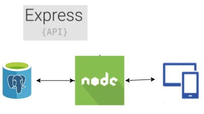

# Dock API

Teste de construção de uma API em node

---

## Arquitetura

Desenho simples da arquitetura. 

<p align="center"> 
  
</p>

## Setup

Clone o repositorio:

```ssh
git clone https://github.com/GabrielXavier92/dock-api.git
```

Configure uma instancia de banco de dados Postgress

## Subindindo a aplicação

> Variáveis de ambiente

Configure as variáveis de ambiente de acordo com o arquivo .env.example

> Scripts

Instale as dependências do projeto

```ssh
npm install
```

Rode os scripts para criar as tabelas e popular o banco

```ssh
npm run database
```

Suba a aplicação com o comando

```ssh
npm run dev
```

## Documentação

* [Desenvolvimento] - Com a aplicação rodando, basta acessar a rota /swagger

## Testes

> Desenvolvimento

Para rodar os testes em modo de desenvolvimento, execute o script

```ssh
npm run test
```

> Cobertura

Caso queira ver a cobertura dos testes, execute o script 

```ssh
npm run test:coverage
```

Sera gerado uma pasta com o nome coverage, dentro dela acesse Icov-report/index.html através do seu navegador para ver a cobertura dos testes